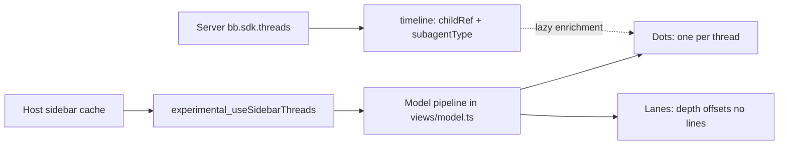

# Agent graph view: investigation and design

> [!IMPORTANT]
> Verdict up front: the data is feasible with no SDK changes, and the graph belongs in this plugin as an **edge-less, indentation-lane** encoding, not a connector-drawn graph. Estimated effort for a testable fourth tab: 1–2 days; with server-backed subagent-type enrichment (stretch), +1–2 days.

There is already prior art on this machine: a separate plugin, Agent Graph (installed under ~/.bb/plugins/agent-graph, source at ~/Documents/code/bb-plugin-agent-graph-fork), draws projects → threads → turns → subagents → tool calls as a pannable tree with connector lines. This report deliberately diverges: it designs the hierarchy for the Activity Overview visual language rather than copying that plugin's rendering, while borrowing its proven data-loading strategy.

## 1. Data feasibility

### 1.1 What the frontend already receives

The thread list is read with `experimental_useSidebarThreads()` (Views.tsx:36). The bundled SDK types (dependency @get-bb/plugin-sdk 0.6.15, resolved in the main checkout at ../node_modules/@get-bb/plugin-sdk, file bundled-types/bb-plugin-sdk-app.d.ts around line 17917, interface `PluginSidebarThread`) expose these relationship-relevant fields per thread:

| Field | Type | Meaning |
| --- | --- | --- |
| `parentThreadId` | `string \| null` | The thread this one was forked from **or spawned under**; null at the root. This is the parent/child link. |
| `lifecycleOwnerThreadId` | `string \| null` | The thread whose lifecycle this one follows; a delegated child stops when its owner stops. |
| `sourceThreadId` + `originKind:"fork"` | `string \| null` | Fork provenance, distinct from delegation-by-parent. |
| `originPluginId` | `string \| null` | Which plugin spawned it, null for non-plugin origins. |
| `activity` | object | Live counts: `backgroundAgents`, `backgroundCommands`, `workflows`, `planMode`, `goals`. |
| `indicator` | enum | Includes `"background-agent"`, `"background-command"`, `"workflow"`, `"plan-mode"`. |
| `isHidden` | boolean | True for threads bb keeps out of its own list (plugin helper threads); the hook **includes** them "so a list that wants them can show them". |
| `status` / `runtimeStatus` / `hasPendingInteraction` / `isUnread` / `queuedWork` | enums/boolean | The inputs the classification pipeline already consumes. |
| `isArchived` / `archivedAt`, `createdAt` / `updatedAt` / `latestAttentionAt` / `lastReadAt` | numbers/null | Lifecycle and age inputs for the idle grey ramp. |
| `href` | string | App-relative URL for the row — hover/tooltip and click-through come free. |
| `environment` / `host` | objects/null | Where the thread runs. |

The plugin's current `buildProjects` (views/model.ts:127) already consumes `parentThreadId` — the parent/child link is proven working in production for all three shipped views.

> [!NOTE]
> Timestamps: the hook hands epoch-milliseconds numbers while `AttnThread` (views/model.ts:6) declares `string | null`. It works today because `Date.parse` coerces a numeric string as epoch ms, so any new model code should keep the same tolerance — or normalize to numbers explicitly in the graph pipeline.

### 1.2 What the server side could query

server.ts is a stub and owns no state, but the plugin server receives `bb.sdk: PluginBbSdk`, the full host SDK bound over loopback (bundled-types/bb-plugin-sdk.d.ts, interface `BbPluginApi` line 22547, `ThreadsArea` at line 16956):

- `threads.list(args)` — filterable by `archived`, `parentThreadId`, `hasParent`, `sourceThreadId`, `originKind`, `originPluginId`, `includeHidden`, `projectId`, `limit`/`offset` (`threadListQuerySchema`, line 14457). So the server can walk the whole family tree, including hidden helper threads, not just what the sidebar page currently shows.
- `threads.timeline(args)` — per-thread rows; delegation rows (`TimelineDelegationWorkRow`, bundled-types/bb-plugin-sdk-app.d.ts line 11974) carry `childRef: string | null`, `background: boolean`, `subagentType: string | null`, plus the report handed back. This is where "what kind of subagent" and fan-out structure live.
- `threads.childSummary(args)` — per thread: `nonDeletedChildCount` and `unarchivedDescendantCount` — cheap depth/size badges without pulling timelines.
- `threads.listRunning()`, `threads.get()`, `threads.spawn()` / `fork()` (spawn args include `parentThreadId`, `lifecycleOwnerThreadId`, `visibility: "agent-only"`).

### 1.3 Gaps, and where nothing is actually missing

Searched for a direct "agent" entity, and the search result is a genuine absence: bb models the agent as the thread. A thread running background agents exposes only **counts** (`activity.backgroundAgents`), not identities. So an agent graph in bb is necessarily a **thread-family graph**. That is compatible with the plugin's invariant "one thread = one dot/unit; per-thread weight is 1 everywhere" — but it means any drawing of individual background agents would violate that invariant, so we do not draw them.

> [!CAUTION]
> No blocker on subagent relationships — state precisely why: (1) `parentThreadId` + `lifecycleOwnerThreadId` exist on every `PluginSidebarThread` the frontend hook returns today; (2) the server-side `threads.list` can query by `parentThreadId`/`hasParent` directly, with `includeHidden` for helper threads; (3) the installed Agent Graph plugin already ships a working implementation built exclusively on these calls (`~/Documents/code/bb-plugin-agent-graph-fork/server.ts:519-545` uses `bb.sdk.threads.timeline` with a 200-entry cache keyed by `thread.updatedAt`, invalidated by host thread events). What was searched: the bundled types (interfaces `PluginSidebarThread`, `ThreadsArea`, `TimelineDelegationWorkRow`, `threadListQuerySchema`, `threadChildSummaryResponseSchema`), the plugin's own runtime data (`buildProjects`), and the fork's server implementation.

What IS missing is detail-level, and it is a cost problem, not an absence:

- `subagentType` (e.g. "explore", "general") and the delegation report exist only inside timeline rows, one HTTP/SDK round trip per thread. Fetching timelines for every thread eagerly would be far too heavy for a glance view — the prior-art plugin dedicates a bounded cache and event-driven invalidation to it.
- The delegation edge direction ("this turn delegated to that child") is per-turn data, not a thread-level field, so edges drawn from timelines are richer but also much more expensive than the `parentThreadId` link.

### 1.4 Lifecycle caveats

- A delegated child stops when its owner stops (`lifecycleOwnerThreadId`); the graph's leaves will legitimately blink in and out as families spawn and fold. This is correct behavior, but the view should avoid re-layout jumps on it — stable row order keyed by thread id.
- `parentThreadId` can point at threads that are archived, deleted, or simply not in the current data page. The model already promotes orphans to roots (views/model.ts:127); the graph needs the same rule plus a cycle guard (`parentThreadId` chains that loop must not hang layout).
- The hook returns active threads only by default; archived relatives break subtrees. Accept the default (idle grey fades them out anyway) and document it, rather than paging through `experimental_archived`.

## 2. Graph design proposal

### 2.1 The tension, honestly stated

A graph wants lines between agents, and line-work is banned here: "grouping comes from proximity, voids, and region fills. No seams or outline systems" (AGENTS.md). Connector edges are the classic solution (and the separate Agent Graph plugin uses exactly that), so this is the one place where the plugin's visual language fights the data's shape. Three encodings were evaluated:

1. **Connector graph** (prior art style, tidy tree with edge lines) — rejected: inherent line-work, and a connected-edge drawing reads as a different product than this plugin's fill-and-proximity language.
2. **Nested regions** (children inside the parent's region) — rejected: nesting requires assigning area, which collides with the fixed invariant that per-thread weight is 1 everywhere (the treemap already owns area semantics), and it only carries shallow trees legibly.
3. **Indentation lanes** — recommended.

### 2.2 Recommended encoding: Agent lanes (edge-less tree by indentation)



The view is a vertical list of families. Each row is one thread, drawn as the same unit dot the other three views use — color from `cellColor`, pulse when working, hover for `tip` — with the hierarchy carried entirely by position:

- **Depth = indentation.** One fixed lane pitch (~14 px) per hierarchy level; roots flush left, each child a lane to the right. In practice bb is typically one or two levels deep (thread → subagent(s)), so the view is almost always one lane wide or two.
- **Family = proximity.** A root and its descendants occupy a contiguous block; children sit close beneath their parent; families are separated by voids (extra vertical gap), not lines. This reuses the exact ordering `buildProjects` already establishes — parents before their children, attention-ascending — so the pure pipeline stays shared.
- **Project = region fill.** Families group into project regions with the neutral fill used by the treemap (#131a22), shelves packed by the existing `shelfPack`. No card outlines; a project label sits in its region's top strip exactly like a treemap label.
- **Dominance stays color-only**: status classes and the grey age ramp come from the existing shared `classify` / `cellColor` functions. Nothing in the graph encodes status by area, border, or fill.
- Hidden threads are drawn (they are real running agents) but can be filtered with the same `!archivedAt` guard; this choice is revisitable without touching the model.

Where this encoding is weaker than a connected graph: multi-level fan-out (grandparent → parent → many children) can lose the exact parent of a mid-lane child when two families interleave. The mitigation is strict family contiguity in the row order — children always directly trail their root's block — which the ordering guarantee makes safe for the observed shapes. If operators later demand explicit edges, that is the moment to split into a separate plugin, not to bend this one.

## 3. Integration plan

### 3.1 Where it slots in

- **Fourth tab** of the existing tab page: append `{ id: "graph", label: "Agent graph" }` to `TABS` (views/Views.tsx:245) and add the render case in `OverviewPage`. `app.tsx` needs no change — the nav slot and routing already serve all tabs under /plugins/activity-overview/board.
- Update `skills/activity-views/SKILL.md` (add the fourth view, its reading rules) and this report's implementation notes when done. No manifest changes: the plugin stays frontend-only for v1.

### 3.2 Model pipeline (pure, in views/model.ts)

```tree
views/model.ts
├── buildAgentTree(threads, projects, nowMs)   # roots, childrenOf, orphans promoted, cycle guard
├── laneRows(tree, nowMs)                      # ordered rows: { thread, depth, fam, rootId }
├── lanePacker(rows, ROW_PITCH, INDENT, gaps)  # y per row; extra void between families/projects
└── reuse: classify, cellColor, tip, attentionScore, shelfPack (project regions unchanged)
```

- `buildAgentTree` generalizes the family logic already inside `buildProjects` (roots + `childrenOf` map) into a reusable function so `buildProjects` can later call it too — single source of truth instead of a second private copy.
- Layout constants (ROW_PITCH, INDENT, DOT size, family void) live with the other rendering constants shared by model and views.
- The view component (`AgentLanesView` in views/Views.tsx) reuses `Stage`, `Dot`, and `LegendRow`; it adds only row positioning and the indentation offset — no new visual systems.

### 3.3 Test plan (tests/model.test.ts, same fixture builder)

Existing file structure passes at baseline (`npm test`, 0 failing as of this investigation). Graph additions mirror it: `thread({ parentThreadId })` fixtures plus assertions for — orphan promotion (child of an unknown/deleted parent becomes a root), cycle guard (parent-thread chains that loop terminate), children sorted by `attentionScore` within a family, parents strictly before children in `laneRows`, depth values monotonic with indentation, archived threads excluded and hidden threads included, contiguous family blocks (no interleaving families), region packing height matches `shelfPack` output, and classification/color reuse is exercised through the shared functions (no duplicated precedence logic to test).

### 3.4 Effort estimate

- Model pipeline + tests: 0.5–1 day.
- View component, tab wiring, skill doc: 0.5 day.
- Polish pass (tooltips, pulse, empty states): 0.5–1 day, optional.
- **Total: 1–2 days** for the frontend-only v1.
- Stretch: subagent-type chips via timeline enrichment — requires turning server.ts into a small data service (bounded timeline cache, host-event invalidation, realtime push to the app, matching the Agent Graph plugin's proven approach): **+1–2 days**, deferred until the lanes view proves worth it.